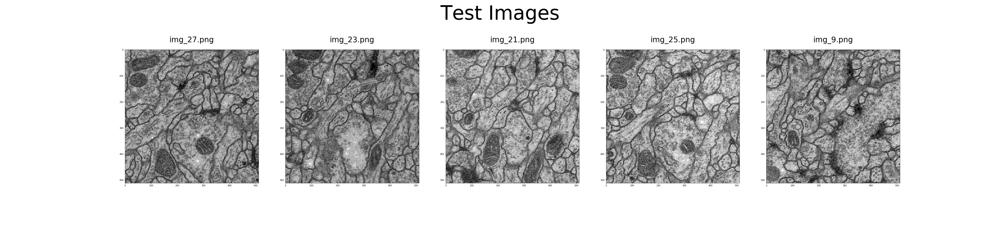
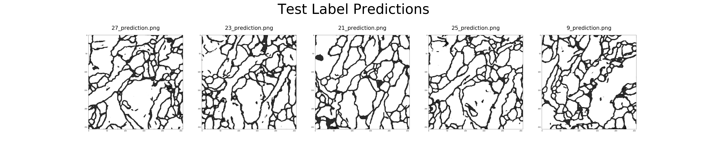

This repo is forked from [zhixuhao](https://github.com/zhixuhao/unet)

# Details

To run this and get the results, as shown in *data/,* simply clone the repo and run *train.py*

# Results

The model yields an outline of the cell membranes from the training & testing data as shown below;

